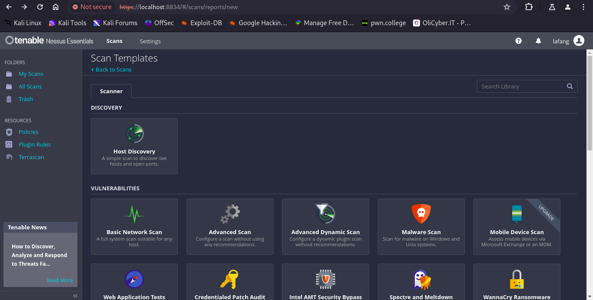

# Vulnerability Scanning

## Overview

In this step, we perform vulnerability scanning on the target Windows 7 system using tools like Nessus to identify potential security weaknesses.

## Tools Used

- Nessus
- Nmap Scripting engine

## Steps and Commands

### Nessus Scan

1. **Installing and Running Nessus:**
   -I Opened Nessus in my browser at: `https://localhost:8834/`
   - Created a new scan using the "Basic Network Scan" template.
   - Entered the target IP address (Windows 7 machine).
   - Launched the scan and waited for it to complete.
   - Analyzed the results for known vulnerabilities.
  
    
   

*Description: I set up Nessus and launched it in my web browser..*


*Description: Here, Nessus is scanning our Windows 7 machine for vulnerabilities*


*Description: Nessus scan results showing identified vulnerabilities.*
### Nmap Scripting engine
I used the Nmap scripting engine to search for vulnerabilities furthermore to establish a congrete understanding of the vulnerabilities before exploiting them. 

```bash
sudo nmap --script smb-vuln* -p 445 192.168.88.13
```
*Description: Here, I used the Nmap engine to scan the target windows 7 machine to check if it was vulnerable to smb related attacks as shown in the image below*

## Findings


- **Vulnerabilities Identified:** From this Nessus and nmap report, we got a lot of vulnerabilities that we can exploit, in a range from critical and so on. 

